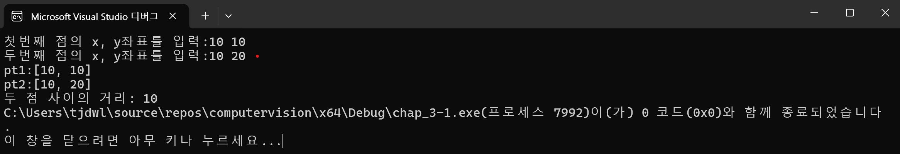
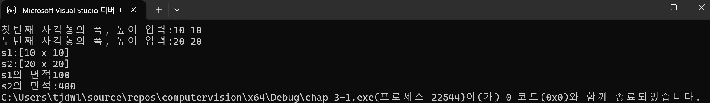
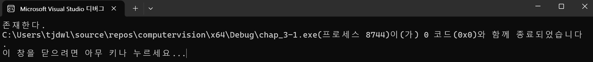
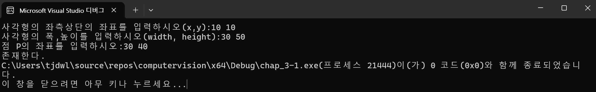
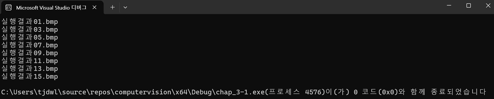

# 1. 두점의 좌표를 키보드로 입력받아 화면에 출력하고 두 점 사이의 거리를 구하여 출력하라.

``` cpp
#include "opencv2/opencv.hpp"							// opencv 헤더파일 추가
#include <iostream>             						// c++ 헤더파일 추가
#include <cmath>										// norm 함수 사용을 위한 헤더파일 추가
using namespace cv;             						// cv(opencv) 네임스페이스 생략
using namespace std;            						// std(c++) 네임스페이스 생략
int main() {											// 메인 함수 선언
	Point a, b;											// Point 객체 선언
	cout << "첫번째 점의 x, y좌표를 입력:";				// 안내문구 출력
	cin >> a.x >> a.y;									// Point 객체 a의 x, y값 설정
	cout << "두번째 점의 x, y좌표를 입력:";				// 안내문구 출력
	cin >> b.x >> b.y;									// Point 객체 b의 x, y값 설정
	cout << "pt1:" << a << endl << "pt2:" << b << endl;	// Point 객체 a, b의 x, y값 출력
	cout << "두 점 사이의 거리: " << norm(a - b);		// Point 객체 a와 b 사이의 거리 출력
	return 0;											// 0을 반환(정상종료)
}														// 메인함수 종료
```



# 2. 두 사각형의 크기를 키보드로 입력받아 화면에 출력하고 두 사각형의 면적을 각각 구하여 출력하라.

``` cpp
#include "opencv2/opencv.hpp"												// opencv 헤더파일 추가
#include <iostream>															// c++ 헤더파일 추가
using namespace cv;															// cv(opencv) 네임스페이스 생략
using namespace std;														// std(c++) 네임스페이스 생략
int main() {																// 메인 함수 선언
	Size a, b;																// Size 객체 선언
	cout << "첫번째 사각형의 폭, 높이 입력:";								// 안내문구 출력
	cin >> a.width >> a.height;												// Size객체 a의 가로세로 값 설정
	cout << "두번째 사각형의 폭, 높이 입력:";								// 안내문구 출력
	cin >> b.width >> b.height;												// Size객체 b의 가로세로 값 설정
	cout << "s1:" << a << endl << "s2:" << b << endl;						// Size 객체 a, b의 가로세로 값 출력
	cout << "s1의 면적" << a.area() << endl << "s2의 면적:" << b.area();	// Size 객체 a, b의 면적 값 출력
	return 0;																// 0을 반환(정상종료)
}
```



# 3. Rect 클래스의 멤버함수 contains를 이용하여 아래 코드의 점 p1이 사각형 r1의 영역 내부에 존재하는지 판단하는 코드를 작성하라.

```cpp
#include "opencv2/opencv.hpp"			// opencv 헤더파일 추가
#include <iostream>						// c++ 헤더파일 추가
using namespace cv;						// cv(opencv) 네임스페이스 생략
using namespace std;					// std(c++) 네임스페이스 생략
int main() {							// 메인 함수 선언
	Rect r1(10, 10, 20, 20);			// Rect 객체 선언
	Point p1(15, 15);					// Point 객체 선언
	if ((r1 + Size(1, 1)).contains(p1))	// rect 객체의 가로세로 값을 1씩 증가시켜 테두리를 모두 포함, p1이 r1안에 존재하는지 확인
		cout << "존재한다.";			// 존재할 경우 실행
	else cout << "존재하지 않는다.";	// 존재하지 않을 경우 실행
	return 0;							// 0을 반환(정상종료)
}										// 메인함수 종료
```



# 4. inside함수를 이용하여 사각형 정보와 점의 좌표를 입력 받아 점이 사각형 내부에 있는지 외부에 있는지 결과를 출력하는 코드를 작성 하시오.

```cpp
#include "opencv2/opencv.hpp"								// opencv 헤더파일 추가
#include <iostream>             							// c++ 헤더파일 추가
using namespace cv;             							// cv(opencv) 네임스페이스 생략
using namespace std;            							// std(c++) 네임스페이스 생략
int main() {												// 메인 함수 선언
	Rect r1;												// Rect 객체 선언
	Point p1;												// Point 객체 선언
	cout << "사각형의 좌측상단의 좌표를 입력하시오(x,y):";	// 안내문구 출력
	cin >> r1.x >> r1.y;									// Rect 객체 r1의 시작 점 좌표값 설정
	cout << "사각형의 폭,높이를 입력하시오(width, height):";// 안내문구 출력
	cin >> r1.width >> r1.height;							// Rect 객체 r1의 가로세로 값 설정
	cout << "점 P의 좌표를 입력하시오:";					// 안내문구 출력
	cin >> p1.x >> p1.y;									// Point 객체 p1의 x, y값 설정
	if (p1.inside(r1 + Size(1, 1)))							// p1이 가로세로 값을 1씩 증가시켜 테두리를 모두 포함한 r1 내에 존재하는지 확인
		cout << "존재한다.";								// 존재할 경우 실행
	else cout << "존재하지 않는다.";						// 존재하지 않을 경우 실행
	return 0;												// 0을 반환(정상종료)
}															// 메인함수 종료
```



# 5. 01~15까지 홀수번 이미지의 파일이름을 출력하라

```cpp
#include "opencv2/opencv.hpp"						// opencv 헤더파일 추가
#include <iostream>									// c++ 헤더파일 추가
using namespace cv;									// cv(opencv) 네임스페이스 생략
using namespace std;								// std(c++) 네임스페이스 생략
int main() {										// 메인 함수 선언
	String str;										// String 객체 선언
	for (int i = -1; i < 16 - 2;) {					// i값이 -1부터 14사이에 있을 때 반복
		str = format("실행결과%02d.bmp", i += 2);	// i 값과 이미지파일 이름의 공통 문자열을 합성시켜 이미지파일 이름 생성
		cout << str << endl;						// 이미지파일 이름 출력
	}												// 반복문 종료
	return 0;										// 0을 반환(정상종료)
}													// 메인함수 종료
```
