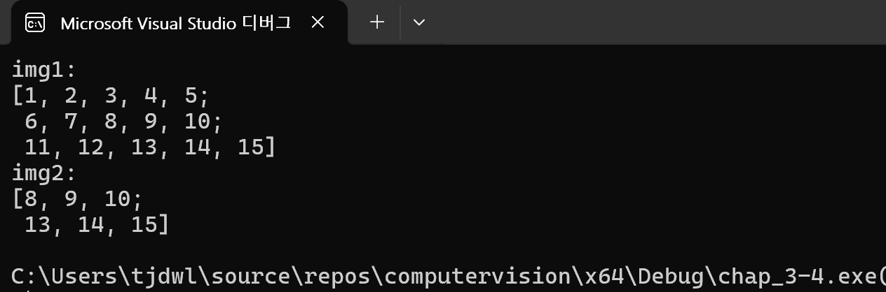
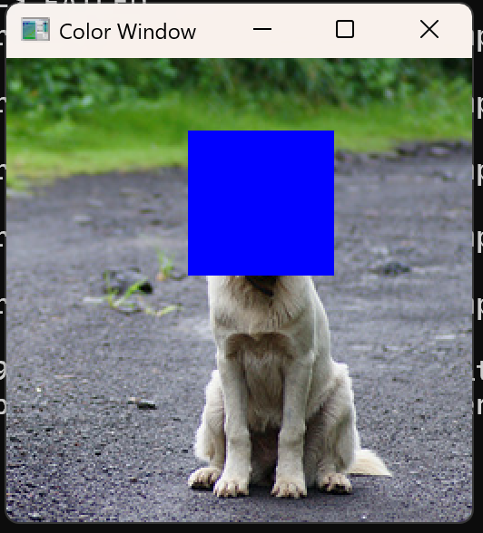
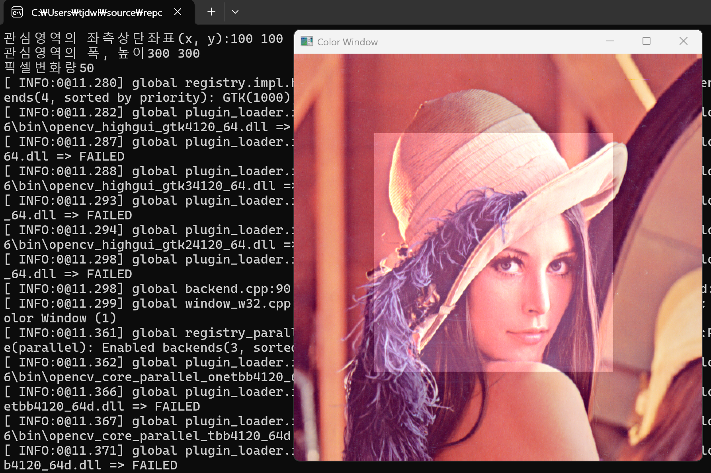

# 1. 얕은 복사와 깊은 복사의 장단점을 각각 쓰시오.

### 얕은 복사 (Shallow Copy)
객체의 실제 데이터가 아닌 데이터가 저장된 메모리 주소(참조 값)만 복사하는 방식이다.

* **장점**
    * 속도가 매우 빠름: 실제 데이터를 복제하지 않고 주소값만 넘기기 때문에 복사 수행 시간이 거의 걸리지 않는다.
    * 메모리 절약: 동일한 데이터를 여러 객체가 공유하므로 메모리 사용량을 최소화할 수 있다.
* **단점**
    * 데이터 독립성 없음: 한 객체에서 원소 값을 수정하면 해당 데이터를 공유하는 다른 객체의 값도 함께 변한다.
    * 의도치 않은 오류 가능성: 원본 데이터가 메모리에서 해제될 경우, 이를 참조하던 다른 객체들이 유효하지 않은 주소를 가리키게 되어 프로그램이 충돌할 수 있다.


### 깊은 복사 (Deep Copy)
원본 데이터와 동일한 내용을 가진 별도의 메모리 공간을 새로 할당하여 데이터를 복제하는 방식아다.

* **장점**
    * 완벽한 독립성: 복사본을 수정해도 원본 데이터에 전혀 영향을 주지 않아 안전한 데이터 처리가 가능하다.
    * 안정성: 각 객체가 자신만의 데이터를 관리하므로, 원본 객체가 소멸되어도 복사본 객체는 영향을 받지 않고 정상 작동한다.
* **단점**
    * 속도 저하: 데이터의 크기가 클수록 메모리를 할당하고 모든 원소를 일일이 복사하는 데 시간이 많이 소요된다.
    * 메모리 낭비: 동일한 데이터가 메모리 상에 중복으로 존재하게 되므로 자원 효율성이 떨어진다.


# 2. 원본 행렬의 일부를 깊은 복사하고 터미널에 각각 출력하시오

``` cpp
#include "opencv2/opencv.hpp"                           // opencv 헤더파일 추가
#include <iostream>                                     // c++ 헤더파일 추가
using namespace cv;                                     // cv(opencv) 네임스페이스 생략
using namespace std;                                    // std(c++) 네임스페이스 생략
int main() {                                            // 메인 함수 선언
    Mat img1 = (Mat_<int>(3, 5) <<                      // 3행 5열의 int형 Mat 객체 선언
        1, 2, 3, 4, 5,                                  // 1행 데이터 초기화
        6, 7, 8, 9, 10,                                 // 2행 데이터 초기화
        11, 12, 13, 14, 15);                            // 3행 데이터 초기화
    Mat img2 = img1(Rect(2, 1, 3, 2)).clone();          // img1의 (2,1)에서 가로3 세로2 크기의 부분행렬을 복사하여 img2에 저장
    cout << "img1:\n" << img1 << "\nimg2:\n" << img2 << endl;// img1, img2 출력
    return 0;                                           // 0을 반환(정상종료)
}                                                       // 메인함수 종료
```



# 3. 이미지에 관심 영역을 설정하고 파란색으로 덮어씌워 출력하시오

```cpp
#include "opencv2/opencv.hpp"                           // opencv 헤더파일 추가
#include <iostream>                                     // c++ 헤더파일 추가
using namespace cv;                                     // cv(opencv) 네임스페이스 생략
using namespace std;                                    // std(c++) 네임스페이스 생략
int main() {                                            // 메인 함수 선언
    Mat img1 = imread("dog.bmp");                       // dog.bmp 이미지 파일을 읽어 Mat 객체에 저장
    if (img1.empty()) {                                 // 이미지 로드 실패 여부 확인
        cout << "Image load failed!" << endl; return 1;}// 실패 시 에러 메시지 출력 후 종료
    Rect roi(100, 40, 80, 80);                          // (100,40)에서 가로80 세로80 크기의 관심영역(ROI) 설정
    img1(roi).setTo(Scalar(255, 0, 0));                 // 관심영역을 파란색(B:255 G:0 R:0)으로 설정
    imshow("Color Window", img1);                       // "Color Window" 이름의 윈도우에 img1 출력
    waitKey(0);                                         // 키 입력이 있을 때까지 대기
    return 0;                                           // 0을 반환(정상종료)
}                                                       // 메인함수 종료
```



# 4. 3번 문제를 활용하여 관심 영역의 이미지를 1초마다 원본과 파란 화면을 번갈아 가며 q가 입력될 때까지 반복하시오

```cpp
#include "opencv2/opencv.hpp"                           // opencv 헤더파일 추가
#include <iostream>                                     // c++ 헤더파일 추가
using namespace cv;                                     // cv(opencv) 네임스페이스 생략
using namespace std;                                    // std(c++) 네임스페이스 생략
int main() {                                            // 메인 함수 선언
    Mat img1 = imread("dog.bmp");                       // dog.bmp 이미지 파일을 읽어 Mat 객체에 저장
    if (img1.empty()) {                                 // 이미지 로드 실패 여부 확인
        cout << "Image load failed!" << endl; return 1;}// 실패 시 에러 메시지 출력 후 종료
    Rect roi(100, 40, 80, 80);                          // (100,40)에서 가로80 세로80 크기의 관심영역(ROI) 설정
    Mat imgcopy[2] = { img1(roi).clone(),               // imgcopy[0]에 원본 관심영역을 복사하여 저장
        Mat(roi.height, roi.width,                      // imgcopy[1]에 관심영역과 동일한 크기의 Mat 객체 생성
        CV_8UC3, Scalar(255, 0, 0)) };                  // imgcopy[1]을 파란색(B:255 G:0 R:0)으로 초기화
    int i = 0;                                          // 반복 횟수 카운터 변수 초기화
    while (true) {                                      // 무한 반복
        imgcopy[i % 2].copyTo(img1(roi));               // i가 짝수면 원본, 홀수면 파란색 이미지를 관심영역에 복사
        imshow("Color Window", img1);                   // "Color Window" 이름의 윈도우에 img1 출력
        if (waitKey(1000) == 'q') break;                // 1초 대기 후 q 키 입력 시 반복문 종료
        i++;                                            // 반복 횟수 1 증가
    }                                                   // 반복문 종료
    return 0;                                           // 0을 반환(정상종료)
}                                                       // 메인함수 종료
```
https://youtube.com/shorts/pe6O5AymxHQ


# 5. 초기에 600 x 200 크기의 흰색 배경의 윈도우를 생성하고 윈도우를 3분할하여 순차적으로 1번째영역부터 3번째영역까지 반복해서 빨간 화면으로 바꾸시오

```cpp
#include "opencv2/opencv.hpp"                           // opencv 헤더파일 추가
#include <iostream>                                     // c++ 헤더파일 추가
using namespace cv;                                     // cv(opencv) 네임스페이스 생략
using namespace std;                                    // std(c++) 네임스페이스 생략
int main() {                                            // 메인 함수 선언
    int x = 0, l = 200;                                 // 사각형의 시작 x좌표와 한 변의 길이 초기화
    Mat img(200, 600, CV_8UC3, Scalar(255, 255, 255));  // 200x600 크기의 흰색 배경 Mat 객체 생성
    while (true) {                                      // 무한 반복
        img.setTo(Scalar(255, 255, 255));               // 매 반복마다 배경을 흰색으로 초기화
        img(Rect(x%600, 0, l, l)).setTo(Scalar(0,0,255));// x%600 위치에 200x200 크기의 빨강 사각형 출력
        imshow("Display", img);                         // "Display" 이름의 윈도우에 img 출력
        if (waitKey(1000) == 'q') break;                // 1초 대기 후 q 키 입력 시 반복문 종료
        x += 200;                                       // x 좌표를 200만큼 이동
        cout << x;                                      // 현재 x 좌표값 출력
    }                                                   // 반복문 종료
    return 0;                                           // 0을 반환(정상종료)
}                                                       // 메인함수 종료
```
https://youtu.be/XINTtDgGBTI

# 6. 관심영역의 좌표, 크기와 픽셀값의 변화량을 입력받아 원본 이미지에 반영하여 출력하시오

```cpp
#include "opencv2/opencv.hpp"                           // opencv 헤더파일 추가
#include <iostream>                                     // c++ 헤더파일 추가
using namespace cv;                                     // cv(opencv) 네임스페이스 생략
using namespace std;                                    // std(c++) 네임스페이스 생략
int main() {                                            // 메인 함수 선언
    Mat img1 = imread("C:/Users/tjdwl/source/repos/"   // 지정된 경로에서
        "computervision/chap_2-3/lenna.bmp");           // lenna.bmp 이미지 파일을 읽어 Mat 객체에 저장
    if (img1.empty()) {                                 // 이미지 로드 실패 여부 확인
        cout << "Image load failed!" << endl; return 1; // 실패 시 에러 메시지 출력 후 종료
    }                                                   // 조건문 종료
    int x, y, h, w, dc;                                // 관심영역 좌표, 크기, 픽셀 변화량 변수 선언
    cout << "관심영역의 좌측상단좌표(x, y):";           // 안내문구 출력
    cin >> x >> y;                                      // 관심영역 시작 좌표 x, y값 입력
    cout << "관심영역의 폭, 높이";                      // 안내문구 출력
    cin >> w >> h;                                      // 관심영역의 가로(w), 세로(h)값 입력
    cout << "픽셀변화량";                               // 안내문구 출력
    cin >> dc;                                          // 픽셀 밝기 변화량 입력
    Rect roi(x, y, w, h);                              // 입력받은 값으로 관심영역(ROI) 설정
    img1(roi) += Scalar(dc, dc, dc);                    // 관심영역의 모든 채널 픽셀값을 dc만큼 증가
    imshow("Color Window", img1);                       // "Color Window" 이름의 윈도우에 img1 출력
    waitKey(0);                                         // 키 입력이 있을 때까지 대기
    return 0;                                           // 0을 반환(정상종료)
}                                                       // 메인함수 종료
```
