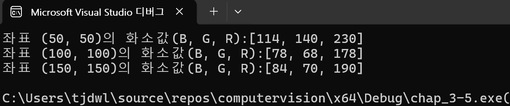
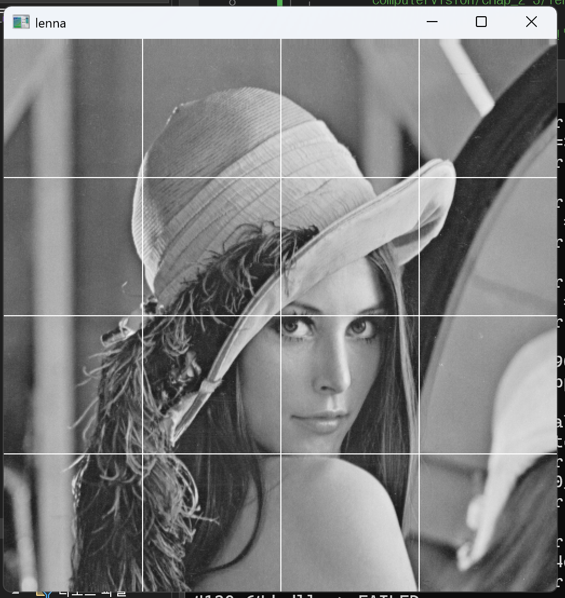
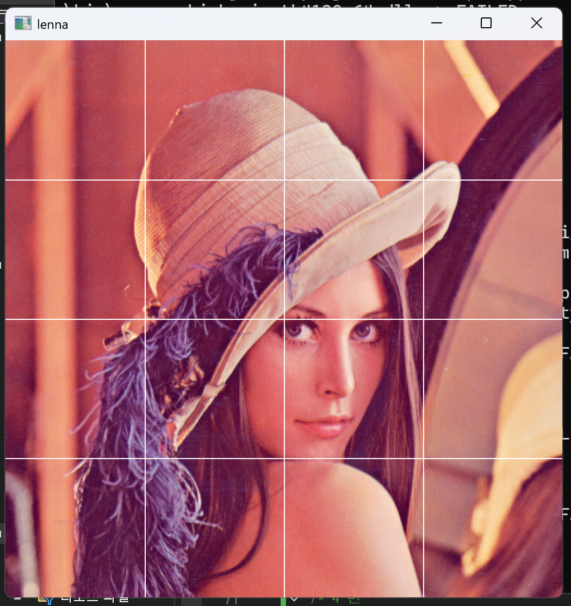
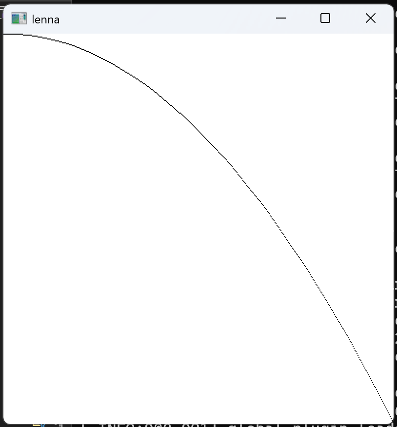

# 1. lenna bmp 영상에서 좌표 (50, 50), (100, 100), (150, 150)에서 픽셀값을 아래처럼 화면에 출력하시오

``` cpp
#include "opencv2/opencv.hpp"                                           // opencv 헤더파일 추가
#include <iostream>                                                     // c++ 헤더파일 추가
using namespace cv;                                                     // cv(opencv) 네임스페이스 생략
using namespace std;                                                    // std(c++) 네임스페이스 생략
int main() {                                                            // 메인 함수 선언
    Mat img1 = imread("C:/Users/tjdwl/source/repos/"                   // 지정된 경로에서
        "computervision/chap_2-3/lenna.bmp");                          // lenna.bmp 이미지 파일을 읽어 Mat 객체에 저장
    if (img1.empty()) {                                                 // 이미지 로드 실패 여부 확인
        cout << "Image load failed!" << endl; return 1;                 // 실패 시 에러 메시지 출력 후 종료
    }                                                                   // 조건문 종료
    Vec3b C3 = img1.at<Vec3b>(50, 50);                                 // (50, 50) 위치의 BGR 픽셀값을 C3에 저장
    cout << "좌표 (50, 50)의 화소값(B, G, R):" << C3 << endl;          // (50, 50) 위치의 BGR 픽셀값 출력
    C3 = img1.at<Vec3b>(100, 100);                                     // (100, 100) 위치의 BGR 픽셀값을 C3에 저장
    cout << "좌표 (100, 100)의 화소값(B, G, R):" << C3 << endl;        // (100, 100) 위치의 BGR 픽셀값 출력
    C3 = img1.at<Vec3b>(150, 150);                                     // (150, 150) 위치의 BGR 픽셀값을 C3에 저장
    cout << "좌표 (150, 150)의 화소값(B, G, R):" << C3 << endl;        // (150, 150) 위치의 BGR 픽셀값 출력
    return 0;                                                           // 0을 반환(정상종료)
}                                                                       // 메인함수 종료
```

# 2. Lenna 영상을 그레이스케일 영상으로 변환 후 화면에 출력하고 다음 실행결과처럼 화면을 4 등분하는 가로 세로선을 그리시오

``` cpp
#include "opencv2/opencv.hpp"                                           // opencv 헤더파일 추가
#include <iostream>                                                     // c++ 헤더파일 추가
using namespace cv;                                                     // cv(opencv) 네임스페이스 생략
using namespace std;                                                    // std(c++) 네임스페이스 생략
int main() {                                                            // 메인 함수 선언
    Mat img1 = imread("C:/Users/tjdwl/source/repos/"                   // 지정된 경로에서
        "computervision/chap_2-3/lenna.bmp", CV_8UC1);                 // lenna.bmp 이미지 파일을 그레이스케일로 읽어 Mat 객체에 저장
    if (img1.empty()) {                                                 // 이미지 로드 실패 여부 확인
        cout << "Image load failed!" << endl; return 1;                 // 실패 시 에러 메시지 출력 후 종료
    }                                                                   // 조건문 종료
    for (int i = 1; i < 4; i++) {                                      // i = 1, 2, 3 반복
        uchar* ptr = img1.ptr<uchar>(img1.rows * i / 4);               // 1/4, 2/4, 3/4 행의 시작 주소를 포인터로 반환
        for (int j = 0; j < img1.cols; j++) {                          // j = 0부터 열 끝까지 반복
            ptr[j] = 255;                                              // 가로선: 해당 행의 j번째 열을 흰색으로
            img1.at<uchar>(j, img1.cols * i / 4) = 255;               // 세로선: j번째 행의 1/4, 2/4, 3/4 열을 흰색으로
        }                                                              // 안쪽 반복문 종료
    }                                                                  // 바깥쪽 반복문 종료
    imshow("lenna", img1);                                             // "lenna" 이름의 윈도우에 img1 출력
    waitKey(0);                                                        // 키 입력이 있을 때까지 대기
    return 0;                                                          // 0을 반환(정상종료)
}                                                                      // 메인함수 종료
```



# 3. Lenna 영상을 컬러 영상으로 읽은 후 화면에 출력하고 다음 실행결과처럼 화면을 4 등분하는 가로 세로선을 그리시오

```cpp
#include "opencv2/opencv.hpp"                                           // opencv 헤더파일 추가
#include <iostream>                                                     // c++ 헤더파일 추가
using namespace cv;                                                     // cv(opencv) 네임스페이스 생략
using namespace std;                                                    // std(c++) 네임스페이스 생략
int main() {                                                            // 메인 함수 선언
    Mat img1 = imread("C:/Users/tjdwl/source/repos/"                   // 지정된 경로에서
        "computervision/chap_2-3/lenna.bmp");                          // lenna.bmp 이미지 파일을 읽어 Mat 객체에 저장
    if (img1.empty()) {                                                 // 이미지 로드 실패 여부 확인
        cout << "Image load failed!" << endl; return 1;                 // 실패 시 에러 메시지 출력 후 종료
    }                                                                   // 조건문 종료
    Vec3b mask(255, 255, 255);                                         // 흰색(B:255 G:255 R:255) Vec3b 객체 선언
    for (int i = 1; i < 4; i++) {                                      // i = 1, 2, 3 반복
        Vec3b* ptr = img1.ptr<Vec3b>(img1.rows * i / 4);               // 1/4, 2/4, 3/4 행의 시작 주소를 Vec3b 포인터로 반환
        for (int j = 0; j < img1.cols; j++) {                          // j = 0부터 열 끝까지 반복
            ptr[j] = mask;                                             // 가로선: 해당 행의 j번째 열을 흰색으로
            img1.col(img1.cols * i / 4).setTo(mask);                  // 세로선: 1/4, 2/4, 3/4 열 전체를 흰색으로
        }                                                              // 안쪽 반복문 종료
    }                                                                  // 바깥쪽 반복문 종료
    imshow("lenna", img1);                                             // "lenna" 이름의 윈도우에 img1 출력
    waitKey(0);                                                        // 키 입력이 있을 때까지 대기
    return 0;                                                          // 0을 반환(정상종료)
}                                                                      // 메인함수 종료
```



# 4. 배경색이 흰색인 400 X 400 영상을 만들고 y = 1 / 400 * x^2의 그래프를 그리시오

```cpp
#include "opencv2/opencv.hpp"                                           // opencv 헤더파일 추가
#include <iostream>                                                     // c++ 헤더파일 추가
using namespace cv;                                                     // cv(opencv) 네임스페이스 생략
using namespace std;                                                    // std(c++) 네임스페이스 생략
int main() {                                                            // 메인 함수 선언
    Mat img1(Size(400, 400), CV_8UC1, 255);                            // 400x400 크기의 흰색 배경 그레이스케일 Mat 객체 생성
    for (int i = 0; i < img1.cols; i++) {                              // i = 0부터 열 끝까지 1씩 증가
        int y = (1.0 / 400) * i * i;                                   // y = (1/400) * x² 계산
        img1.ptr<uchar>(y)[i] = 0;                                     // y행의 i열에 검정색 점 찍기
    }                                                                  // 반복문 종료
    imshow("lenna", img1);                                             // "lenna" 이름의 윈도우에 img1 출력
    waitKey(0);                                                        // 키 입력이 있을 때까지 대기
    return 0;                                                          // 0을 반환(정상종료)
}                                                                      // 메인함수 종료
```
