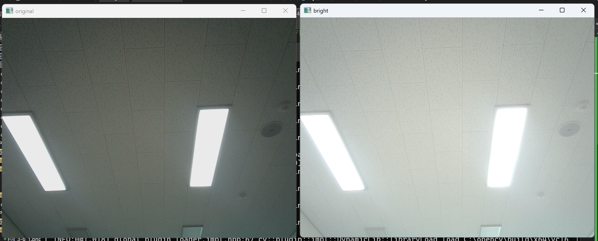
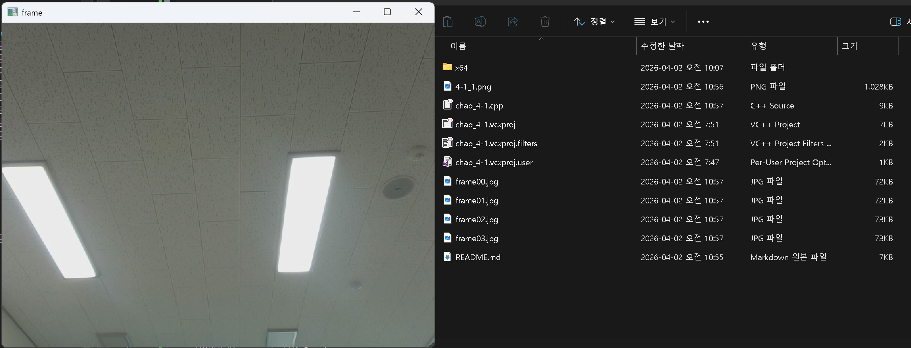
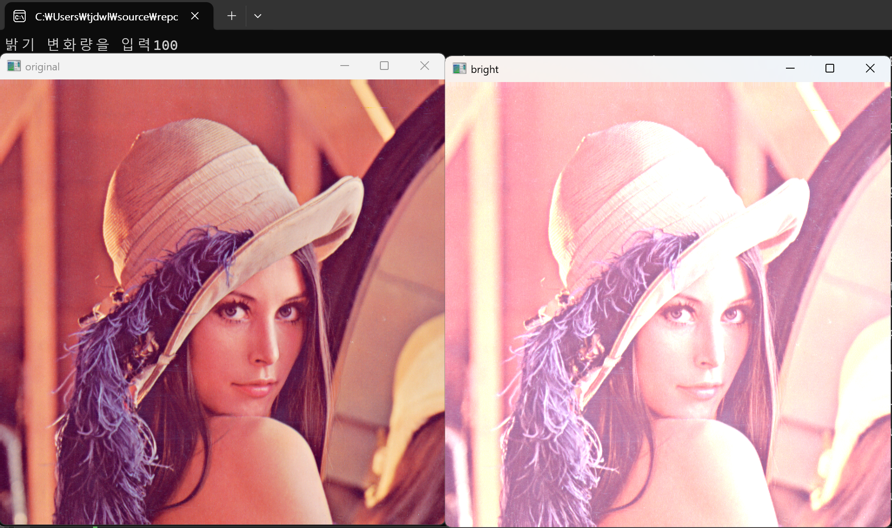

# 1. 멀티미디어 및 비디오 처리 관련 용어 정리

## 1. API (Application Programming Interface)
**정의:** 응용 프로그램에서 운영체제나 라이브러리의 기능을 사용할 수 있도록 미리 정해놓은 함수나 통신 규약이다.

**역할:** 개발자가 하드웨어 내부 동작을 몰라도 특정 기능을 쉽게 구현할 수 있게 돕는 징검다리 역할을 한다.

## 2. V4L (Video4Linux)
**정의:** 리눅스 시스템에서 실시간 비디오 캡처를 지원하기 위한 디바이스 드라이버 및 API 세트이다.

**역할:** 현재는 웹캠, TV 튜너 등 다양한 장치를 지원하는 V4L2가 표준으로 사용된다.

## 3. FFMPEG
**정의:** 디지털 오디오와 비디오를 기록, 변환, 스트리밍하는 오픈 소스 멀티미디어 프레임워크다.

**역할:** 거의 모든 종류의 코덱과 포맷을 지원하며, 영상 편집 소프트웨어나 플레이어의 핵심 엔진으로 쓰인다.

## 4. DirectShow
**정의:** 윈도우 기반 매체에서 멀티미디어 스트림을 조작하기 위해 마이크로소프트가 개발한 이전 세대 API다.

**역할:** 필터 단위를 연결하여 데이터를 처리하며, 오래된 웹캠과의 호환성을 위해 여전히 사용된다.

## 5. MSMF (Microsoft Media Foundation)
**정의:** DirectShow를 대체하기 위해 마이크로소프트가 도입한 차세대 멀티미디어 플랫폼이다.

**역할:** 고해상도 콘텐츠 처리 및 하드웨어 가속 성능을 더 효율적으로 지원한다.

## 6. GStreamer
**정의:** 다양한 멀티미디어 구성 요소를 연결하여 파이프라인을 구축하는 오픈 소스 프레임워크다.

**역할:** 리눅스 표준으로 주로 쓰이며, 오디오/비디오 재생 및 스트리밍에 매우 유연한 구조를 가지고 있다.

# 2. 사진을 imread 함수를 이용하여 Mat 객체에 저장하고 영상의 행의 수 열의 수 채널수 type 을 화면에 출력하는 코드를 작성하시오

``` cpp*/
#include <opencv2/opencv.hpp>                                           // opencv 헤더파일 추가
#include <iostream>                                                     // c++ 헤더파일 추가
#include <string>                                                       // string 헤더파일 추가
using namespace cv;                                                     // cv(opencv) 네임스페이스 생략
using namespace std;                                                    // std(c++) 네임스페이스 생략
string get_type_string(int type) {                                      // Mat 타입을 문자열로 변환하는 함수 선언
    switch (type) {                                                     // type 값에 따라 분기
    case CV_8UC1:  return "CV_8UC1";                                   // 8비트 1채널
    case CV_8UC2:  return "CV_8UC2";                                   // 8비트 2채널
    case CV_8UC3:  return "CV_8UC3";                                   // 8비트 3채널
    case CV_8UC4:  return "CV_8UC4";                                   // 8비트 4채널
    case CV_16UC1: return "CV_16UC1";                                  // 16비트 부호없는 1채널
    case CV_16SC1: return "CV_16SC1";                                  // 16비트 부호있는 1채널
    case CV_32FC1: return "CV_32FC1";                                  // 32비트 실수형 1채널
    case CV_64FC1: return "CV_64FC1";                                  // 64비트 실수형 1채널
    default:       return "Unknown Type";                              // 그 외 타입
    }                                                                   // switch문 종료
}                                                                       // 함수 종료
int main() {                                                            // 메인 함수 선언
    Mat img = imread("phone_photo.jpg", IMREAD_UNCHANGED);             // phone_photo.jpg를 원본 그대로 읽어 Mat 객체에 저장
    if (img.empty()) {                                                  // 이미지 로드 실패 여부 확인
        cout << "이미지를 불러올 수 없습니다." << endl;                 // 실패 시 에러 메시지 출력
        return -1;                                                      // -1을 반환(비정상종료)
    }                                                                   // 조건문 종료
    cout << "행의 수 (Rows): " << img.rows << endl;                    // 이미지의 행(세로) 크기 출력
    cout << "열의 수 (Cols): " << img.cols << endl;                    // 이미지의 열(가로) 크기 출력
    cout << "채널 수 (Channels): " << img.channels() << endl;         // 이미지의 채널 수 출력
    cout << "타입 (Type): " << get_type_string(img.type()) << endl;   // 이미지의 타입 문자열 출력
    return 0;                                                           // 0을 반환(정상종료)
}                                                                       // 메인함수 종료
```



# 3. 행렬연산을 이용하여 아래 수식에서 행렬 X 를 구하는 프로그램을 작성하시오

```cpp
#include <opencv2/opencv.hpp>                                           // opencv 헤더파일 추가
#include <iostream>                                                     // c++ 헤더파일 추가
using namespace cv;                                                     // cv(opencv) 네임스페이스 생략
using namespace std;                                                    // std(c++) 네임스페이스 생략
int main() {                                                            // 메인 함수 선언
    Mat A = (Mat_<float>(2, 2) << 1, 3, -4, 2);                       // 2x2 float형 행렬 A 선언 및 초기화
    Mat B = (Mat_<float>(2, 2) << 2, 3, 0, 5);                        // 2x2 float형 행렬 B 선언 및 초기화
    Mat C = (Mat_<float>(2, 2) << -2, -2, -2, -3);                    // 2x2 float형 행렬 C 선언 및 초기화
    Mat X = 3 * A + B.inv() + 10 * C - 5;                             // X = 3A + B의역행렬 + 10C - 5 계산
    cout << "Matrix A:\n" << A << "\n" << endl;                        // 행렬 A 출력
    cout << "Matrix B:\n" << B << "\n" << endl;                        // 행렬 B 출력
    cout << "Matrix C:\n" << C << "\n" << endl;                        // 행렬 C 출력
    cout << "Result Matrix X:\n" << X << endl;                         // 결과 행렬 X 출력
    return 0;                                                           // 0을 반환(정상종료)
}                                                                       // 메인함수 종료
```



# 4. 행렬 연산을 이용하여 영상의 밝기를 수정하는 프로그램을 작성하시오

```cpp
#include <iostream>                                                     // c++ 헤더파일 추가
#include <opencv2/opencv.hpp>                                           // opencv 헤더파일 추가
using namespace std;                                                    // std(c++) 네임스페이스 생략
using namespace cv;                                                     // cv(opencv) 네임스페이스 생략
int main(void) {                                                        // 메인 함수 선언
    Mat image = imread("C:/Users/tjdwl/source/repos/"                  // 지정된 경로에서
        "computervision/chap_2-3/lenna.bmp"), bright;                  // lenna.bmp를 읽어 image에 저장, bright 객체 선언
    if (image.empty()) {                                                // 이미지 로드 실패 여부 확인
        cerr << "Frame is empty!" << endl; return 1; }                 // 실패 시 에러 메시지 출력 후 종료
    int num;                                                            // 밝기 변화량 변수 선언
    cout << "밝기 변화량을 입력";                                       // 안내문구 출력
    cin >> num;                                                         // 밝기 변화량 입력
    bright = image + Scalar(num, num, num);                            // 모든 채널에 num을 더해 밝기 조절한 이미지 생성
    imshow("original", image);                                         // "original" 윈도우에 원본 이미지 출력
    imshow("bright", bright);                                          // "bright" 윈도우에 밝기 조절 이미지 출력
    waitKey(0);                                                        // 키 입력이 있을 때까지 대기
    return 0;                                                           // 0을 반환(정상종료)
}                                                                       // 메인함수 종료
```
