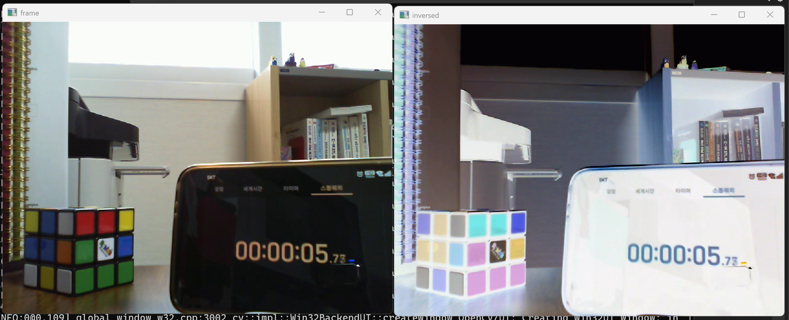
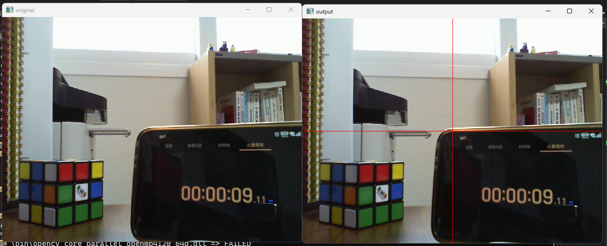
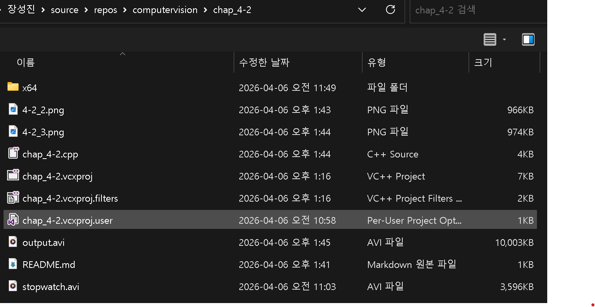
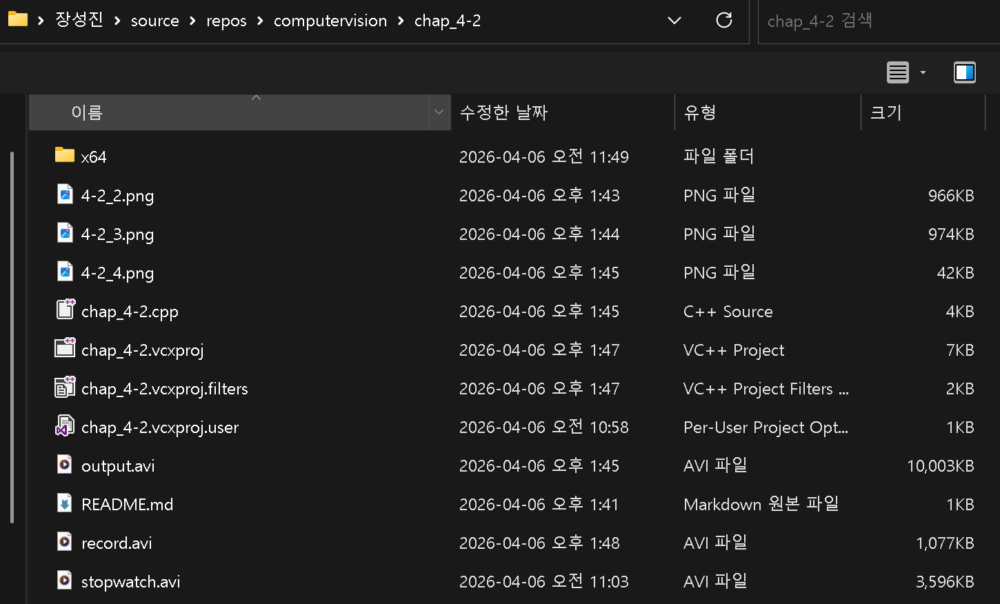

# 2. 비디오 코덱 및 압축 표준 관련 용어 정리

## 1. MPEG-4

**정의:** 멀티미디어 데이터를 저장, 전송하기 위한 오디오 및 비디오 압축 기술의 집합적인 표준 규격이다.

**역할:** 낮은 대역폭에서도 준수한 화질을 제공하여 웹 스트리밍, 모바일 기기, 화상 회의 등 다양한 환경의 기반 기술이 된다.

## 2. DivX (Digital Video Express)

**정의:** MPEG-4 표준을 기반으로 개발된 상용 비디오 코덱으로, 고화질 영상을 높은 압축률로 저장할 수 있게 고안되었다.

**역할:** 과거 DVD급 영상을 CD 한 장 분량으로 압축하여 PC 기반 영상 공유 및 재생의 대중화를 이끌었다.

## 3. Xvid

**정의:** 상용화된 DivX에 대응하여 만들어진 오픈 소스 기반의 MPEG-4 비디오 코덱이다.

**역할:** DivX와 대등한 성능을 무료(GPL 라이선스)로 제공하며, 오픈 소스 라이브러리인 OpenCV와도 호환성이 매우 뛰어나다.

## 4. H.264 (AVC - Advanced Video Coding)

**정의:** 현재 가장 널리 사용되는 고효율 영상 압축 표준으로, MPEG-4 Part 10으로도 불린다.

**역할:** 기존 방식보다 압축 효율이 월등히 뛰어나 유튜브, 넷플릭스, HDTV 방송 등 현대 멀티미디어 스트리밍의 표준으로 자리 잡았다.

## 5. H.265 (HEVC - High Efficiency Video Coding)

**정의:** H.264의 후속 규격으로 개발되었으며, 4K 이상의 초고해상도 콘텐츠 처리를 위한 고효율 비디오 코덱이다.

**역할:** H.264 대비 약 2배 이상의 압축 효율을 가져 동일 화질에서 용량을 절반으로 줄일 수 있으나, 인코딩 시 높은 연산 능력을 요구한다.


# 2. 동영상을 R,G,B 값 모두 100 만큼 증가시킨 후 원본과 결과영상을 모두 출력하라 무한루프로 작성하고 q or Q 를 누르면 종료

``` cpp
#include <opencv2/opencv.hpp>                                            // opencv 헤더파일 추가
using namespace cv;                                                      // cv(opencv) 네임스페이스 생략
int main(void) {                                                         // 메인 함수 선언
    VideoCapture cap("stopwatch.avi");                                   // stopwatch.avi 파일을 VideoCapture 객체로 열기
    if (!cap.isOpened()) return -1;                                      // 파일 열기 실패 시 -1 반환(비정상종료)
    Mat frame;                                                           // 프레임을 저장할 Mat 객체 선언
    int delay = (int)(1000 / cap.get(CAP_PROP_FPS));                    // FPS를 이용해 프레임 간 대기시간(ms) 계산
    while (true) {                                                       // 무한 루프 시작
        int64 t = getTickCount();                                        // 현재 틱 카운트 저장(처리 시간 측정용)
        cap >> frame;                                                    // 다음 프레임을 읽어 frame에 저장
        if (frame.empty()) break;                                        // 프레임이 비어있으면(영상 끝) 루프 종료
        imshow("frame", frame);                                          // "frame" 윈도우에 원본 프레임 출력
        imshow("inversed", ~frame);                                      // "inversed" 윈도우에 반전된 프레임 출력
        int dt = (int)((getTickCount() - t) * 1000 / getTickFrequency()); // 프레임 처리에 걸린 시간(ms) 계산
        if (waitKey(max(1, delay - dt)) == 27) break;                   // 처리시간을 뺀 나머지 시간 대기, ESC(27) 입력 시 종료
    }                                                                    // while 루프 종료
    return 0;                                                            // 0을 반환(정상종료)
}                                                                        // 메인함수 종료
```




# 3. 동영상에 빨간 십자선을 그린 후 원본과 결과영상을 모두 출력하고 동영상파일로 저장하라

```cpp
#include <opencv2/opencv.hpp>                                            // opencv 헤더파일 추가
#include <iostream>                                                      // c++ 헤더파일 추가
using namespace cv;                                                      // cv(opencv) 네임스페이스 생략
using namespace std;                                                     // std(c++) 네임스페이스 생략
int main() {                                                             // 메인 함수 선언
    VideoCapture cap("stopwatch.avi");                                   // stopwatch.avi 파일을 VideoCapture 객체로 열기
    if (!cap.isOpened()) return -1;                                      // 파일 열기 실패 시 -1 반환(비정상종료)
    int w = cvRound(cap.get(CAP_PROP_FRAME_WIDTH));                     // 영상의 가로(프레임 너비) 크기를 정수로 저장
    int h = cvRound(cap.get(CAP_PROP_FRAME_HEIGHT));                    // 영상의 세로(프레임 높이) 크기를 정수로 저장
    double fps = cap.get(CAP_PROP_FPS);                                 // 영상의 초당 프레임 수(FPS) 저장
    int delay = cvRound(1000 / fps);                                    // FPS를 이용해 프레임 간 대기시간(ms) 계산
    VideoWriter dst_writer("output.avi",                                // 출력 파일명 "output.avi" 지정
        VideoWriter::fourcc('M', 'J', 'P', 'G'), fps, Size(w, h));     // MJPG 코덱, 원본 fps·크기로 VideoWriter 생성
    Mat frame, dst;                                                      // 원본 프레임·출력 프레임을 저장할 Mat 객체 선언
    while (true) {                                                       // 무한 루프 시작
        cap >> frame;                                                    // 다음 프레임을 읽어 frame에 저장
        if (frame.empty()) break;                                        // 프레임이 비어있으면(영상 끝) 루프 종료
        dst = frame.clone();                                             // 원본 프레임을 복사하여 dst에 저장
        line(dst, Point(w / 2, 0), Point(w / 2, h),                    // dst에 수직 중앙선의 시작점·끝점 지정
            Scalar(0, 0, 255), 1);                                      // 빨간색(BGR), 두께 1로 수직 중앙선 그리기
        line(dst, Point(0, h / 2), Point(w, h / 2),                    // dst에 수평 중앙선의 시작점·끝점 지정
            Scalar(0, 0, 255), 1);                                      // 빨간색(BGR), 두께 1로 수평 중앙선 그리기
        dst_writer.write(dst);                                           // 십자선이 그려진 프레임을 출력 파일에 저장
        imshow("original", frame);                                       // "original" 윈도우에 원본 프레임 출력
        imshow("output", dst);                                           // "output" 윈도우에 십자선 프레임 출력
        char key = (char)waitKey(delay);                                 // delay(ms) 동안 키 입력 대기 후 저장
        if (key == 'q' || key == 'Q') break;                            // 'q' 또는 'Q' 입력 시 루프 종료
    }                                                                    // while 루프 종료
    return 0;                                                            // 0을 반환(정상종료)
}                                                                        // 메인함수 종료
```




# 4. 카메라로 촬영한 영상을 동영상 파일로 저장하는 프로그램을 작성하라 q or Q 를 누르면 종료

```cpp
#include <opencv2/opencv.hpp>                                            // opencv 헤더파일 추가
#include <iostream>                                                      // c++ 헤더파일 추가
using namespace cv;                                                      // cv(opencv) 네임스페이스 생략
using namespace std;                                                     // std(c++) 네임스페이스 생략
int main() {                                                             // 메인 함수 선언
    VideoCapture cap(0);                                                 // 기본 카메라(인덱스 0) 열기
    if (!cap.isOpened()) return -1;                                      // 카메라 열기 실패 시 -1 반환(비정상종료)
    int w = cvRound(cap.get(CAP_PROP_FRAME_WIDTH));                     // 카메라 프레임 가로 크기를 정수로 저장
    int h = cvRound(cap.get(CAP_PROP_FRAME_HEIGHT));                    // 카메라 프레임 세로 크기를 정수로 저장
    double fps = cap.get(CAP_PROP_FPS);                                 // 카메라의 FPS 저장
    if (fps < 1) fps = 30;                                              // FPS가 1 미만이면(인식 불가) 기본값 30으로 설정
    VideoWriter writer("output.avi",                                    // 출력 파일명 "output.avi" 지정
        VideoWriter::fourcc('M', 'J', 'P', 'G'), fps, Size(w, h));     // MJPG 코덱, 카메라 fps·크기로 VideoWriter 생성
    if (!writer.isOpened()) return -1;                                  // VideoWriter 생성 실패 시 -1 반환(비정상종료)
    Mat frame;                                                           // 프레임을 저장할 Mat 객체 선언
    while (true) {                                                       // 무한 루프 시작
        cap >> frame;                                                    // 카메라에서 프레임을 읽어 frame에 저장
        if (frame.empty()) break;                                        // 프레임이 비어있으면 루프 종료
        writer.write(frame);                                             // 현재 프레임을 출력 파일에 저장
        imshow("record", frame);                                         // "record" 윈도우에 현재 프레임 출력
        char key = (char)waitKey(max(1, cvRound(1000 / fps)));          // FPS 기반 대기시간(최소 1ms) 동안 키 입력 대기
        if (key == 'q' || key == 'Q') break;                            // 'q' 또는 'Q' 입력 시 루프 종료
    }                                                                    // while 루프 종료
    return 0;                                                            // 0을 반환(정상종료)
}                                                                        // 메인함수 종료
```




# 5. 카메라가 활성화된 시점부터 원하는 시점에서 s 키를 누르면 동영상 파일로 저장을 시작하고 e 키를 누르면 저장 및 프로그램을 종료

```cpp
#include <opencv2/opencv.hpp>                                            // opencv 헤더파일 추가
#include <iostream>                                                      // c++ 헤더파일 추가
using namespace cv;                                                      // cv(opencv) 네임스페이스 생략
using namespace std;                                                     // std(c++) 네임스페이스 생략
int main() {                                                             // 메인 함수 선언
    VideoCapture cap(0);                                                 // 기본 카메라(인덱스 0) 열기
    if (!cap.isOpened()) return -1;                                      // 카메라 열기 실패 시 -1 반환(비정상종료)
    int w = cvRound(cap.get(CAP_PROP_FRAME_WIDTH));                     // 카메라 프레임 가로 크기를 정수로 저장
    int h = cvRound(cap.get(CAP_PROP_FRAME_HEIGHT));                    // 카메라 프레임 세로 크기를 정수로 저장
    double fps = cap.get(CAP_PROP_FPS);                                 // 카메라의 FPS 저장
    VideoWriter writer;                                                  // 파일 저장용 VideoWriter 객체 선언(미초기화)
    Mat frame;                                                           // 프레임을 저장할 Mat 객체 선언
    bool recording = false;                                              // 녹화 중 여부를 나타내는 플래그, 초기값 false
    while (true) {                                                       // 무한 루프 시작
        cap >> frame;                                                    // 카메라에서 프레임을 읽어 frame에 저장
        if (frame.empty()) break;                                        // 프레임이 비어있으면 루프 종료
        if (recording) writer.write(frame);                             // 녹화 중이면 현재 프레임을 파일에 저장
        imshow("frame", frame);                                          // "frame" 윈도우에 현재 프레임 출력
        char key = waitKey(10);                                          // 10ms 동안 키 입력 대기 후 저장
        if (key == 's' && !recording) {                                 // 's' 입력 시 & 녹화 중이 아닐 때
            writer.open("record.avi",                                   // 출력 파일명 "record.avi" 지정
                VideoWriter::fourcc('M', 'J', 'P', 'G'), fps, Size(w, h)); // MJPG 코덱, 카메라 fps·크기로 writer 열기
            recording = true;                                           // 녹화 시작 플래그를 true로 변경
        }
        else if (key == 'e') break;                                     // 'e' 입력 시 루프 종료
    }                                                                    // while 루프 종료
    return 0;                                                            // 0을 반환(정상종료)
}                                                                        // 메인함수 종료
```

