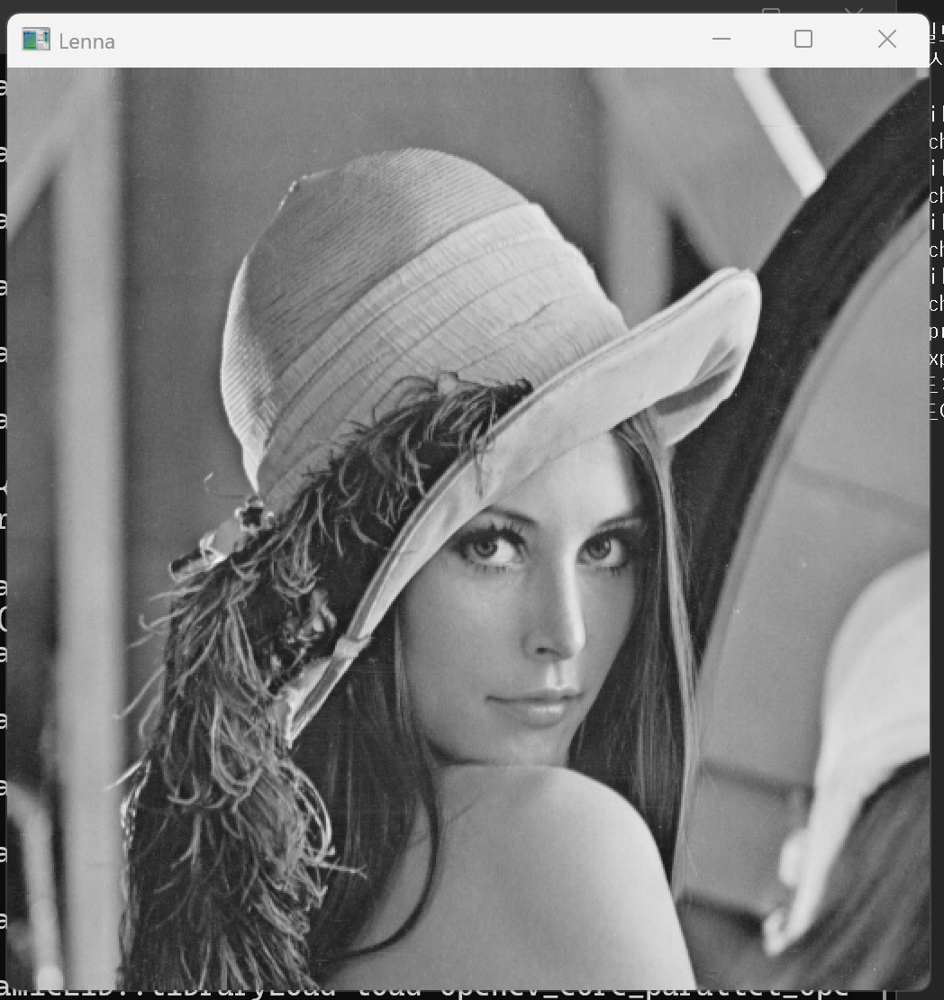
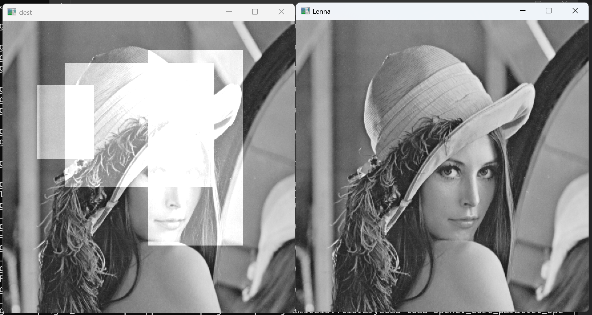

# 1. 마우스 왼쪽 버튼 클릭 시 그레이스케일 이미지 전체 밝기가 10 증가하고, 오른쪽 버튼 클릭 시 10 감소하는 프로그램을 작성하시오

``` cpp
#include <opencv2/opencv.hpp>                                            // opencv 헤더파일 추가
#include <iostream>                                                      // c++ 헤더파일 추가
using namespace std;                                                     // std(c++) 네임스페이스 사용
using namespace cv;                                                      // cv(opencv) 네임스페이스 사용
void on_mouse(int event, int x, int y, int flags, void* userdata) {     // 마우스 콜백 함수 정의
    Mat& img = *(Mat*)userdata;                                          // userdata를 Mat 포인터로 변환하여 img에 참조
    if (event == EVENT_LBUTTONDOWN) {                                    // 마우스 왼쪽 버튼 클릭 이벤트일 때
        img += 10; imshow("Lenna", img); }                              // 전체 픽셀값을 10 증가(밝게) 후 화면에 표시
    else if (event == EVENT_RBUTTONDOWN) {                               // 마우스 오른쪽 버튼 클릭 이벤트일 때
        img -= 10; imshow("Lenna", img); }                              // 전체 픽셀값을 10 감소(어둡게) 후 화면에 표시
}                                                                        // 콜백 함수 끝
int main() {                                                             // 메인 함수 시작
    Mat img = imread("C:/Users/tjdwl/source/repos/"                     // 이미지 불러오기
        "computervision/chap_2-3/lenna.bmp", IMREAD_GRAYSCALE);         // lenna.bmp를 그레이스케일로 읽어 img에 저장
    if (img.empty()) return -1;                                          // 이미지 로드 실패 시 -1 반환(오류처리)
    namedWindow("Lenna");                                                // "Lenna" 이름의 창을 생성
    setMouseCallback("Lenna", on_mouse, &img);                          // "Lenna" 창에서 on_mouse 콜백 등록, img 주소 전달
    imshow("Lenna", img);                                                // "Lenna" 창에 초기 이미지 표시
    while (true) {                                                       // 무한 루프 시작
        if (waitKey(100) == 'q') break;                                 // 100ms 대기 후 'q' 입력 시 루프 종료
    }                                                                    // while 루프 끝
    return 0;                                                            // 0을 반환(정상종료)
}                                                                        // 메인함수 끝
```




# 2. 마우스 드래그로 관심영역(ROI)을 선택하면 해당 영역의 픽셀값을 100 증가시키는 프로그램을 작성하시오 (원본 창과 결과 창을 각각 표시할 것)

``` cpp
#include <opencv2/opencv.hpp>                                            // opencv 헤더파일 추가
#include <iostream>                                                      // c++ 헤더파일 추가
using namespace std;                                                     // std(c++) 네임스페이스 사용
using namespace cv;                                                      // cv(opencv) 네임스페이스 사용
void on_mouse(int event, int x, int y, int flags, void* userdata) {     // 마우스 콜백 함수 정의
    Mat& dest = *(Mat*)userdata;                                         // userdata를 Mat 포인터로 변환하여 dest에 참조
    static Point oldp(-1, -1);                                           // 드래그 시작 좌표(정적 변수, 초기값 (-1,-1))
    if (event == EVENT_LBUTTONDOWN) oldp = Point(x, y);                 // 왼쪽 버튼 클릭 시 시작 좌표를 oldp에 저장
    if (event == EVENT_LBUTTONUP) {                                      // 왼쪽 버튼 업 이벤트일 때
        Rect roi(oldp, Point(x, y));                                     // 시작점~끝점으로 ROI 사각형 생성
        dest(roi) += 100;                                                // ROI 영역의 픽셀값을 100 증가(밝게)
        imshow("dest", dest);                                            // "dest" 창에서 변경된 이미지 표시
    }                                                                    // 조건블록 끝
}                                                                        // 콜백 함수 끝
int main() {                                                             // 메인 함수 시작
    Mat img = imread("C:/Users/tjdwl/source/repos/"                     // 이미지 불러오기
        "computervision/chap_2-3/lenna.bmp", IMREAD_GRAYSCALE);         // lenna.bmp를 그레이스케일로 읽어 img에 저장
    Mat dest = img.clone();                                              // img를 복사하여 dest에 저장
    if (img.empty() && dest.empty()) return -1;                         // img와 dest 모두 비어있으면 -1 반환(오류처리)
    namedWindow("Lenna");                                                // "Lenna" 이름의 창을 생성
    namedWindow("dest");                                                 // "dest" 이름의 창을 생성
    setMouseCallback("Lenna", on_mouse, &dest);                         // "Lenna" 창에서 on_mouse 콜백 등록, dest 주소 전달
    imshow("Lenna", img);                                                // "Lenna" 창에 원본 이미지 표시
    imshow("dest", dest);                                                // "dest" 창에 원본 이미지 표시
    while (true) {                                                       // 무한 루프 시작
        if (waitKey(100) == 'q') break;                                 // 100ms 대기 후 'q' 입력 시 루프 종료
    }                                                                    // while 루프 끝
    return 0;                                                            // 0을 반환(정상종료)
}                                                                        // 메인함수 끝
```




# 3. 트랙바(0~1)로 증가/감소 모드를 선택하고, 마우스 왼쪽 버튼 클릭 시 이미지 전체 밝기를 ±10 변경하는 프로그램을 작성하시오

``` cpp
#include <opencv2/opencv.hpp>                                            // opencv 헤더파일 추가
#include <iostream>                                                      // c++ 헤더파일 추가
using namespace std;                                                     // std(c++) 네임스페이스 사용
using namespace cv;                                                      // cv(opencv) 네임스페이스 사용
bool plus_minus = false;                                                 // 밝기 증가/감소 방향 플래그(false=증가, true=감소)
void on_change(int pos, void* userdata) {                               // 트랙바 콜백 함수 정의
    plus_minus = pos;                                                    // 트랙바 위치값(0 또는 1)을 plus_minus에 저장
}                                                                        // 콜백 함수 끝
void on_mouse(int event, int x, int y, int flags, void* userdata) {     // 마우스 콜백 함수 정의
    Mat& img = *(Mat*)userdata;                                          // userdata를 Mat 포인터로 변환하여 img에 참조
    if (event == EVENT_LBUTTONDOWN) {                                    // 마우스 왼쪽 버튼 클릭 이벤트일 때
        (plus_minus) ? img -= 10 : img += 10;                           // plus_minus가 true면 10 감소, false면 10 증가
        imshow("Lenna", img);                                            // "Lenna" 창에 변경된 이미지 표시
    }                                                                    // 조건블록 끝
}                                                                        // 콜백 함수 끝
int main() {                                                             // 메인 함수 시작
    Mat img = imread("C:/Users/tjdwl/source/repos/"                     // 이미지 불러오기
        "computervision/chap_2-3/lenna.bmp", IMREAD_GRAYSCALE);         // lenna.bmp를 그레이스케일로 읽어 img에 저장
    if (img.empty()) return -1;                                          // 이미지 로드 실패 시 -1 반환(오류처리)
    namedWindow("Lenna");                                                // "Lenna" 이름의 창을 생성
    setMouseCallback("Lenna", on_mouse, &img);                          // "Lenna" 창에서 on_mouse 콜백 등록, img 주소 전달
    createTrackbar("mode", "Lenna", 0, 1, on_change);                   // "Lenna" 창에 0~1 범위의 트랙바 생성
    imshow("Lenna", img);                                                // "Lenna" 창에 초기 이미지 표시
    while (true) {                                                       // 무한 루프 시작
        if (waitKey(10) == 'q') break;                                  // 10ms 대기 후 'q' 입력 시 루프 종료
    }                                                                    // while 루프 끝
    return 0;                                                            // 0을 반환(정상종료)
}                                                                        // 메인함수 끝
```

https://github.com/user-attachments/assets/8f236fbe-ba51-4975-a01a-fb4e0145be48


# 4. 마우스 드래그 중 현재 픽셀과 상하좌우 인접 4픽셀의 밝기를 100 증가시켜 그림을 그리는 프로그램을 작성하시오

``` cpp
#include <opencv2/opencv.hpp>                                            // opencv 헤더파일 추가
#include <iostream>                                                      // c++ 헤더파일 추가
using namespace std;                                                     // std(c++) 네임스페이스 사용
using namespace cv;                                                      // cv(opencv) 네임스페이스 사용
void on_mouse(int event, int x, int y, int flags, void* userdata) {     // 마우스 콜백 함수 정의
    int d[5][2] = { {0,0}, {0,-1}, {0,1}, {-1,0}, {1,0} };            // 현재 픽셀 + 상하좌우 4방향 이웃의 배열(행,열 순)
    static bool dragging = false;                                        // 드래그 중 여부 플래그(정적 변수, 초기값 false)
    Mat& img = *(Mat*)userdata;                                          // userdata를 Mat 포인터로 변환하여 img에 참조
    if (event == EVENT_LBUTTONDOWN) dragging = true;                    // 왼쪽 버튼 클릭 시 드래그 시작(true)
    else if (event == EVENT_LBUTTONUP) dragging = false;                // 왼쪽 버튼 업 시 드래그 종료(false)
    if (event == EVENT_MOUSEMOVE && dragging) {                         // 마우스 이동 이벤트 & 드래그 중일 때
        for (int i = 0; i < 5; i++) {                                   // 현재 픽셀 + 상하좌우 5개 픽셀을 위해 반복
            Point p(x + d[i][1], y + d[i][0]);                         // 방향별로 이웃한 픽셀 좌표 계산(x=열, y=행)
            if (Rect(0, 0, img.cols, img.rows).contains(p))            // 해당 좌표가 이미지 범위 안에 있을 때
                img.at<uchar>(p) = saturate_cast<uchar>(               // 해당 픽셀값에 100을 더하되
                    img.at<uchar>(p) + 100);                            // 0~255 범위를 넘지 않도록 포화 연산 적용
        }                                                                // 반복문 끝
        imshow("Lenna", img);                                            // "Lenna" 창에 변경된 이미지 표시
    }                                                                    // 조건블록 끝
}                                                                        // 콜백 함수 끝
int main() {                                                             // 메인 함수 시작
    Mat img = imread("C:/Users/tjdwl/source/repos/"                     // 이미지 불러오기
        "computervision/chap_2-3/lenna.bmp", IMREAD_GRAYSCALE);         // lenna.bmp를 그레이스케일로 읽어 img에 저장
    if (img.empty()) return -1;                                          // 이미지 로드 실패 시 -1 반환(오류처리)
    namedWindow("Lenna");                                                // "Lenna" 이름의 창을 생성
    setMouseCallback("Lenna", on_mouse, &img);                          // "Lenna" 창에서 on_mouse 콜백 등록, img 주소 전달
    imshow("Lenna", img);                                                // "Lenna" 창에 초기 이미지 표시
    while (true) if (waitKey(10) == 'q') break;                         // 10ms 대기 후 'q' 입력 시 루프 종료
    return 0;                                                            // 0을 반환(정상종료)
}                                                                        // 메인함수 끝
```

https://github.com/user-attachments/assets/435e8605-3a8f-4769-aee7-12444ca26ae3
