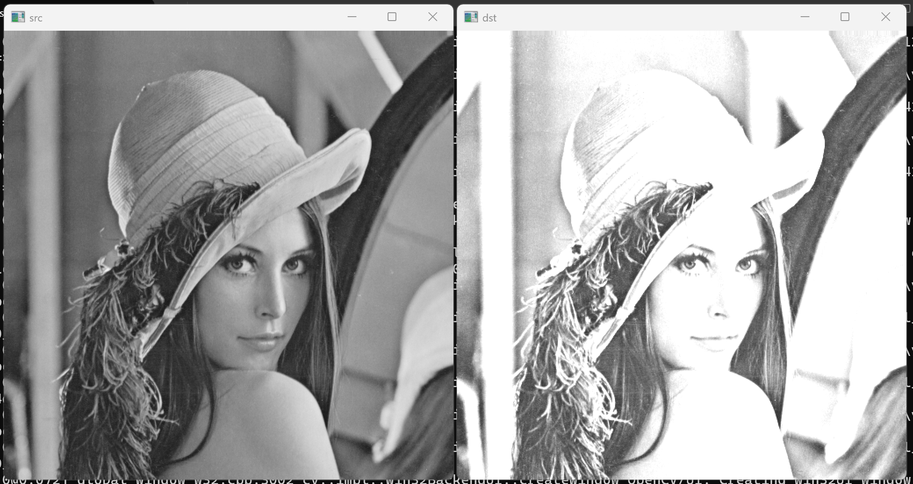
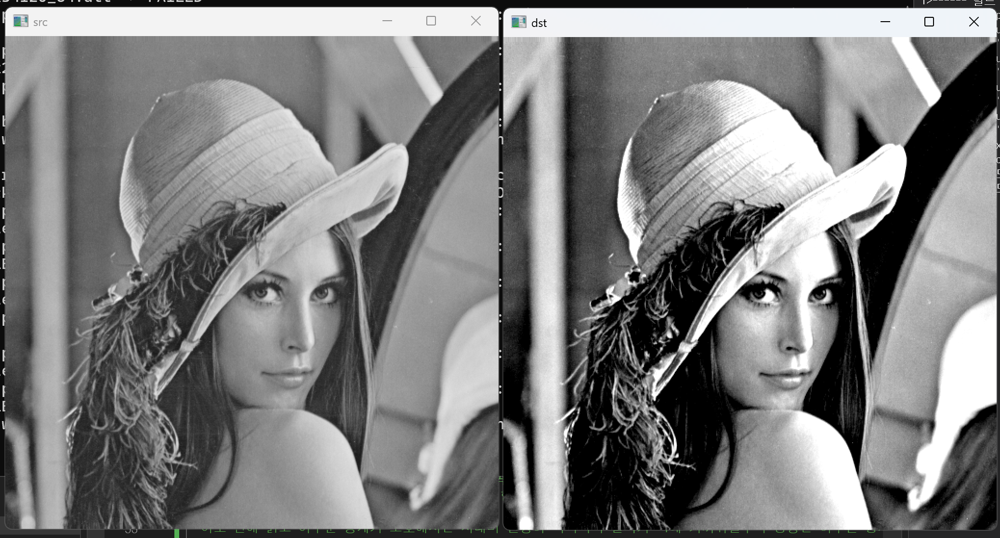
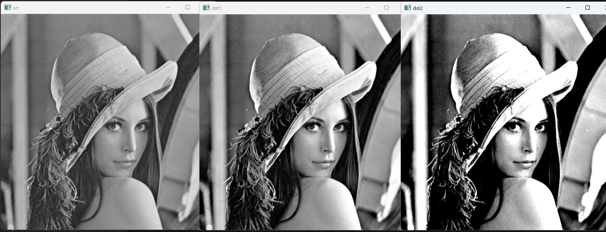
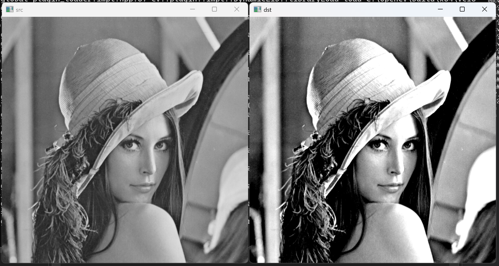

# 1. 코드 5-5에서 연산자 함수를 사용하지 않고 픽셀값을 직접 참조하는 방식으로 밝기를 2배 스케일링하는 프로그램을 작성하시오

``` cpp
#include <opencv2/opencv.hpp>                                            // opencv 헤더파일 추가
#include <iostream>                                                      // c++ 헤더파일 추가
using namespace std;                                                     // std(c++) 네임스페이스 사용
using namespace cv;                                                      // cv(opencv) 네임스페이스 사용
int main() {
    Mat src = imread("C:/Users/tjdwl/source/repos/"                     // 이미지 불러오기
        "computervision/chap_2-3/lenna.bmp", IMREAD_GRAYSCALE);         // lenna.bmp를 그레이스케일로 읽어 src에 저장
    float s = 2.f;                                                       // 밝기 스케일 인수 설정(2배)
    Mat dst = src.clone();                                               // src를 복사하여 dst에 저장
    for (int i = 0; i < src.rows; i++) {                                // 행(세로) 방향으로 반복
        for (int j = 0; j < src.cols; j++) {                           // 열(가로) 방향으로 반복
            dst.at<uchar>(i, j) = saturate_cast<uchar>(src.at<uchar>(i, j) * s); // 픽셀값에 s를 곱하되 0~255 범위로 포화 처리
        }                                                                // 열 반복문 끝
    }                                                                    // 행 반복문 끝
    imshow("src", src);                                                  // "src" 창에 원본 이미지 표시
    imshow("dst", dst);                                                  // "dst" 창에 결과 이미지 표시
    waitKey(0);                                                          // 키 입력 대기
    return 0;                                                            // 0을 반환(정상종료)
}                                                                        // 메인함수 끝
```




# 2. 코드 5-6에서 연산자 함수를 사용하지 않고 픽셀값을 직접 참조하는 방식으로 명암비를 개선하는 프로그램을 작성하시오 (α=1.0)

``` cpp
#include <opencv2/opencv.hpp>                                            // opencv 헤더파일 추가
#include <iostream>                                                      // c++ 헤더파일 추가
using namespace std;                                                     // std(c++) 네임스페이스 사용
using namespace cv;                                                      // cv(opencv) 네임스페이스 사용
int main() {
    Mat src = imread("C:/Users/tjdwl/source/repos/"                     // 이미지 불러오기
        "computervision/chap_2-3/lenna.bmp", IMREAD_GRAYSCALE);         // lenna.bmp를 그레이스케일로 읽어 src에 저장
    float alpha = 1.f;                                                   // 명암비 조절 인수 설정(1.0)
    Mat dst = src.clone();                                               // src를 복사하여 dst에 저장
    for (int i = 0; i < src.rows; i++) {                                // 행(세로) 방향으로 반복
        for (int j = 0; j < src.cols; j++) {                           // 열(가로) 방향으로 반복
            int srcval = src.at<uchar>(i, j);                          // 현재 픽셀값을 int로 읽기
            float dstval = srcval + (srcval - 128) * alpha;             // 128 기준으로 명암비 조절값 계산
            dst.at<uchar>(i, j) = saturate_cast<uchar>(dstval);        // 계산값을 0~255 범위로 포화 후 저장
        }                                                                // 열 반복문 끝
    }                                                                    // 행 반복문 끝
    imshow("src", src);                                                  // "src" 창에 원본 이미지 표시
    imshow("dst", dst);                                                  // "dst" 창에 결과 이미지 표시
    waitKey(0);                                                          // 키 입력 대기
    return 0;                                                            // 0을 반환(정상종료)
}                                                                        // 메인함수 끝
```




# 3. α가 너무 크거나 너무 작을 때 명암비 조절 결과를 비교하고 이유를 설명하시오 (α=2.0 vs α=0.5)

``` cpp
#include <opencv2/opencv.hpp>                                            // opencv 헤더파일 추가
#include <iostream>                                                      // c++ 헤더파일 추가
using namespace std;                                                     // std(c++) 네임스페이스 사용
using namespace cv;                                                      // cv(opencv) 네임스페이스 사용
int main() {
    Mat src = imread("C:/Users/tjdwl/source/repos/"                     // 이미지 불러오기
        "computervision/chap_2-3/lenna.bmp", IMREAD_GRAYSCALE);         // lenna.bmp를 그레이스케일로 읽어 src에 저장
    float alpha1 = 0.5f;                                                 // 명암비 인수 소값(0.5) 설정
    float alpha2 = 2.f;                                                  // 명암비 인수 대값(2.0) 설정
    Mat dst1 = src.clone();                                              // src를 복사하여 dst1에 저장
    Mat dst2 = src.clone();                                              // src를 복사하여 dst2에 저장
    for (int i = 0; i < src.rows; i++) {                                // 행(세로) 방향으로 반복
        for (int j = 0; j < src.cols; j++) {                           // 열(가로) 방향으로 반복
            int srcval = src.at<uchar>(i, j);                          // 현재 픽셀값을 int로 읽기
            float dstval1 = srcval + (srcval - 128) * alpha1;           // alpha1로 명암비 조절값 계산(완화)
            float dstval2 = srcval + (srcval - 128) * alpha2;           // alpha2로 명암비 조절값 계산(강화)
            dst1.at<uchar>(i, j) = saturate_cast<uchar>(dstval1);      // 계산값을 0~255 범위로 포화 후 dst1에 저장
            dst2.at<uchar>(i, j) = saturate_cast<uchar>(dstval2);      // 계산값을 0~255 범위로 포화 후 dst2에 저장
        }                                                                // 열 반복문 끝
    }                                                                    // 행 반복문 끝
    imshow("src", src);                                                  // "src" 창에 원본 이미지 표시
    imshow("dst1", dst1);                                                // "dst1" 창에 alpha=0.5 결과 표시
    imshow("dst2", dst2);                                                // "dst2" 창에 alpha=2.0 결과 표시
    waitKey(0);                                                          // 키 입력 대기
    return 0;                                                            // 0을 반환(정상종료)
}                                                                        // 메인함수 끝
```

α가 너무 큰 경우(α=2.0): 128보다 밝은 픽셀은 급격히 밝아져 255에 포화되고, 128보다 어두운 픽셀은 급격히 어두워져 0에 포화된다. 결과적으로 중간 톤이 사라지면서 명암 경계가 극단적으로 나뉘어 이미지가 거칠고 디테일이 손실된다.

α가 너무 작은 경우(α=0.5): 128 기준의 편차가 절반으로 줄어들어 모든 픽셀이 128에 가까워진다. 밝고 어두운 영역의 차이가 줄어들면서 이미지 전체가 회색에 가깝게 평탄해져 대비가 낮아진다.




# 4. 코드 5-6에서 기준값 128을 입력 영상 픽셀값의 평균으로 변경하여 명암비를 개선하는 프로그램을 작성하시오

``` cpp
#include <opencv2/opencv.hpp>                                            // opencv 헤더파일 추가
#include <iostream>                                                      // c++ 헤더파일 추가
using namespace std;                                                     // std(c++) 네임스페이스 사용
using namespace cv;                                                      // cv(opencv) 네임스페이스 사용
int main() {
    Mat src = imread("C:/Users/tjdwl/source/repos/"                     // 이미지 불러오기
        "computervision/chap_2-3/lenna.bmp", IMREAD_GRAYSCALE);         // lenna.bmp를 그레이스케일로 읽어 src에 저장
    float alpha = 1.f;                                                   // 명암비 조절 인수 설정(1.0)
    Scalar m = mean(src);                                                // 영상 전체 픽셀의 평균값 계산
    int avg = m[0];                                                      // 그레이스케일 평균값을 avg에 저장(채널 0)
    cout << avg << "\n\n\n\n\n";                                        // 평균값 출력(확인용, 약 124)
    Mat dst = src.clone();                                               // src를 복사하여 dst에 저장
    for (int i = 0; i < src.rows; i++) {                                // 행(세로) 방향으로 반복
        for (int j = 0; j < src.cols; j++) {                           // 열(가로) 방향으로 반복
            int srcval = src.at<uchar>(i, j);                          // 현재 픽셀값을 int로 읽기
            float dstval = srcval + (srcval - avg) * alpha;             // 평균값 기준으로 명암비 조절값 계산
            dst.at<uchar>(i, j) = saturate_cast<uchar>(dstval);        // 계산값을 0~255 범위로 포화 후 저장
        }                                                                // 열 반복문 끝
    }                                                                    // 행 반복문 끝
    imshow("src", src);                                                  // "src" 창에 원본 이미지 표시
    imshow("dst", dst);                                                  // "dst" 창에 결과 이미지 표시
    waitKey(0);                                                          // 키 입력 대기
    return 0;                                                            // 0을 반환(정상종료)
}                                                                        // 메인함수 끝
```


