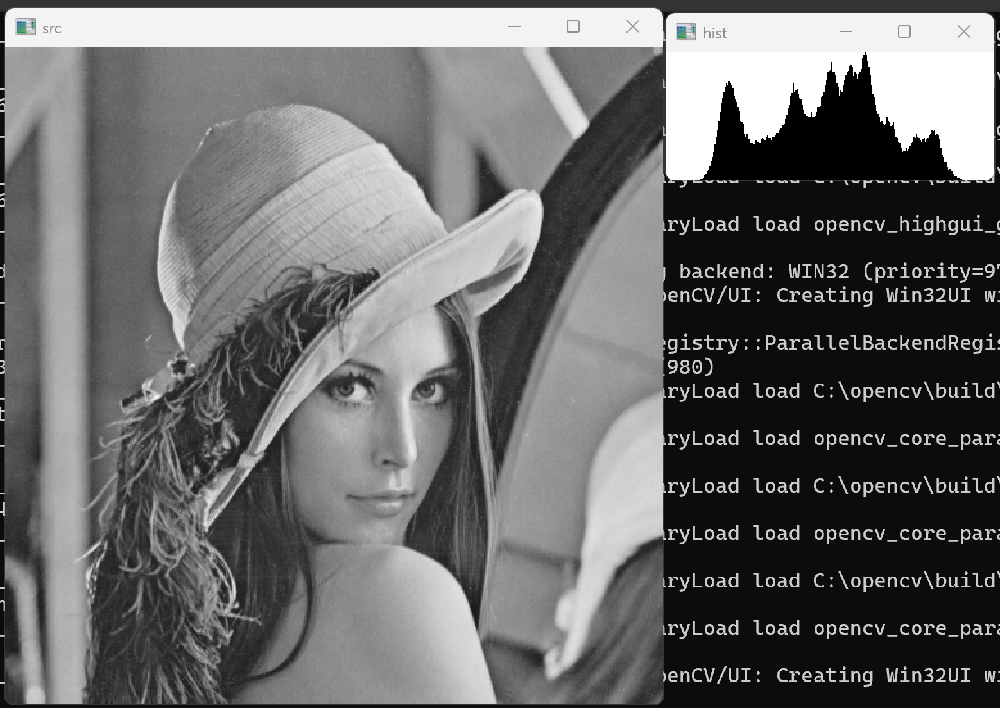
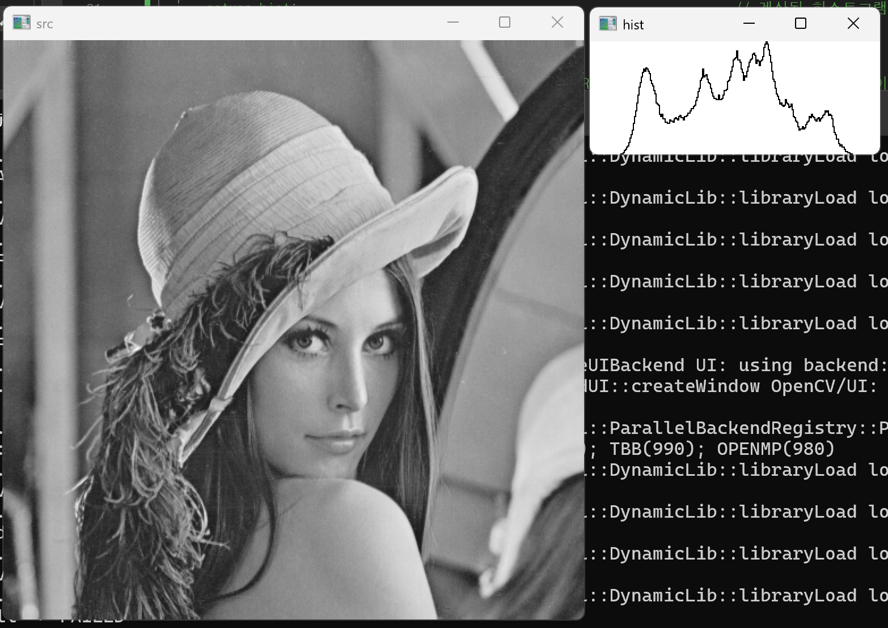

# 1. 앞 예제에서 calcGrayHist 함수를 직접구현하여 같은 결과가 나오도록 작성하라. 함수명은 mycalcGrayHist으로 정의하고 매개변수와 리턴타입은 calcGrayHist 함수와 같게 정의하라. / 교재 219페이지 코드를 참고하라.

``` cpp
#include <opencv2/opencv.hpp>                                            // opencv 헤더파일 추가
#include <iostream>                                                      // c++ 헤더파일 추가
using namespace std;                                                     // std(c++) 네임스페이스 생략
using namespace cv;                                                      // cv(opencv) 네임스페이스 생략
Mat getGrayHistImage(const Mat& hist) {                                  // 히스토그램 데이터를 시각화 이미지로 변환하는 함수 정의
    CV_Assert(hist.type() == CV_32FC1);                                  // hist가 32비트 float 1채널인지 검증(아니면 오류)
    CV_Assert(hist.size() == Size(1, 256));                              // hist 크기가 1x256인지 검증(아니면 오류)
    double histMax;                                                      // 히스토그램 최댓값을 저장할 변수 선언
    minMaxLoc(hist, 0, &histMax);                                        // hist에서 최솟값(무시)·최댓값을 찾아 histMax에 저장
    Mat imgHist(100, 256, CV_8UC1, Scalar(255));                        // 100x256 크기의 흰색 8비트 1채널 히스토그램 이미지 생성
    for (int i = 0; i < 256; i++) {                                     // 256개의 밝기 레벨(0~255)에 대해 반복
        line(imgHist,                                                    // imgHist에
            Point(i, 100),                                               // 막대 하단(바닥)을 시작점으로
            Point(i, 100 - cvRound(                                      // 막대 상단을 끝점으로(높이 = 빈도 비율 × 100)
                hist.at<float>(i, 0) * 100 / histMax)),                 // i번째 빈도값을 최댓값 대비 비율로 정규화
            Scalar(0));                                                  // 검정색으로 수직 막대선 그리기
    }                                                                    // 반복문 종료
    return imgHist;                                                      // 완성된 히스토그램 이미지 반환
}                                                                        // 함수 종료
Mat calcGrayHist(const Mat& img) {                                       // 그레이스케일 이미지의 히스토그램을 계산하는 함수 정의
    CV_Assert(img.type() == CV_8UC1);                                    // img가 8비트 1채널인지 검증(아니면 오류)
    Mat hist;                                                            // 히스토그램 결과를 저장할 Mat 객체 선언
    int channels[] = { 0 };                                             // 히스토그램을 계산할 채널 인덱스(0번 채널)
    int dims = 1;                                                        // 히스토그램 차원 수(1차원)
    const int histSize[] = { 256 };                                      // 히스토그램 빈(bin)의 수(256개)
    float graylevel[] = { 0, 256 };                                      // 히스토그램 계산 범위(0~255)
    const float* ranges[] = { graylevel };                               // 범위 배열의 포인터
    calcHist(&img, 1, channels, noArray(),                               // img 1장, 0번 채널, 마스크 없이
        hist, dims, histSize, ranges);                                   // 1차원 256빈 히스토그램 계산 후 hist에 저장
    return hist;                                                         // 계산된 히스토그램 반환
}                                                                        // 함수 종료
int main() {                                                             // 메인 함수 선언
    Mat src = imread("C:/Users/tjdwl/source/repos/"                     // 지정된 경로에서
        "computervision/chap_2-3/lenna.bmp", IMREAD_GRAYSCALE);         // lenna.bmp를 그레이스케일로 읽어 src에 저장
    imshow("src", src);                                                  // "src" 윈도우에 원본 이미지 출력
    Mat hist = calcGrayHist(src);                                        // src의 그레이스케일 히스토그램 계산
    Mat histimg = getGrayHistImage(hist);                                // 히스토그램 데이터를 막대그래프 이미지로 변환
    imshow("hist", histimg);                                             // "hist" 윈도우에 히스토그램 이미지 출력
    waitKey(0);                                                          // 키 입력이 있을 때까지 대기
    return 0;                                                            // 0을 반환(정상종료)
}                                                                        // 메인함수 종료
```




# 2. lenna.bmp 영상의 히스토그램 그래프를 아래 그림처럼 그려보시오. 함수명은 mygetGrayHistImage 으로 정의하고 매개변수와 리턴타입은 getGrayHistImage 함수와 같게 정의하라. 힌트: line함수를 이용하여 막대그래프의 끝점끼리 직선으로 이어준다. 직선을 그리는 반복문은 i=0에서 i=254까지 임을 주의하라.

``` cpp
#include <opencv2/opencv.hpp>                                            // opencv 헤더파일 추가
#include <iostream>                                                      // c++ 헤더파일 추가
using namespace std;                                                     // std(c++) 네임스페이스 생략
using namespace cv;                                                      // cv(opencv) 네임스페이스 생략
Mat getGrayHistImage(const Mat& hist) {                                  // 히스토그램 데이터를 시각화 이미지로 변환하는 함수 정의
    CV_Assert(hist.type() == CV_32FC1);                                  // hist가 32비트 float 1채널인지 검증(아니면 오류)
    CV_Assert(hist.size() == Size(1, 256));                              // hist 크기가 1x256인지 검증(아니면 오류)
    double histMax;                                                      // 히스토그램 최댓값을 저장할 변수 선언
    minMaxLoc(hist, 0, &histMax);                                        // hist에서 최솟값(무시)·최댓값을 찾아 histMax에 저장
    Mat imgHist(100, 256, CV_8UC1, Scalar(255));                        // 100x256 크기의 흰색 8비트 1채널 히스토그램 이미지 생성
    for (int i = 1; i < 256; i++) {                                     // 1번 인덱스부터 255까지 반복(인접 빈 연결)
        line(imgHist,                                                    // imgHist에
            Point(i, 100 - cvRound(                                      // i-1번째 빈의 높이를 시작점으로
                hist.at<float>(i-1, 0) * 100 / histMax)),               // i-1번째 빈도값을 최댓값 대비 비율로 정규화
            Point(i, 100 - cvRound(                                      // i번째 빈의 높이를 끝점으로
                hist.at<float>(i, 0) * 100 / histMax)),                 // i번째 빈도값을 최댓값 대비 비율로 정규화
            Scalar(0));                                                  // 검정색으로 인접한 두 빈을 연결하는 선 그리기
    }                                                                    // 반복문 종료
    return imgHist;                                                      // 완성된 히스토그램 이미지 반환
}                                                                        // 함수 종료
Mat calcGrayHist(const Mat& img) {                                       // 그레이스케일 이미지의 히스토그램을 계산하는 함수 정의
    CV_Assert(img.type() == CV_8UC1);                                    // img가 8비트 1채널인지 검증(아니면 오류)
    Mat hist;                                                            // 히스토그램 결과를 저장할 Mat 객체 선언
    int channels[] = { 0 };                                             // 히스토그램을 계산할 채널 인덱스(0번 채널)
    int dims = 1;                                                        // 히스토그램 차원 수(1차원)
    const int histSize[] = { 256 };                                      // 히스토그램 빈(bin)의 수(256개)
    float graylevel[] = { 0, 256 };                                      // 히스토그램 계산 범위(0~255)
    const float* ranges[] = { graylevel };                               // 범위 배열의 포인터
    calcHist(&img, 1, channels, noArray(),                               // img 1장, 0번 채널, 마스크 없이
        hist, dims, histSize, ranges);                                   // 1차원 256빈 히스토그램 계산 후 hist에 저장
    return hist;                                                         // 계산된 히스토그램 반환
}                                                                        // 함수 종료
int main() {                                                             // 메인 함수 선언
    Mat src = imread("C:/Users/tjdwl/source/repos/"                     // 지정된 경로에서
        "computervision/chap_2-3/lenna.bmp", IMREAD_GRAYSCALE);         // lenna.bmp를 그레이스케일로 읽어 src에 저장
    imshow("src", src);                                                  // "src" 윈도우에 원본 이미지 출력
    Mat hist = calcGrayHist(src);                                        // src의 그레이스케일 히스토그램 계산
    Mat histimg = getGrayHistImage(hist);                                // 히스토그램 데이터를 꺾은선 그래프 이미지로 변환
    imshow("hist", histimg);                                             // "hist" 윈도우에 히스토그램 이미지 출력
    waitKey(0);                                                          // 키 입력이 있을 때까지 대기
    return 0;                                                            // 0을 반환(정상종료)
}                                                                        // 메인함수 종료
```


